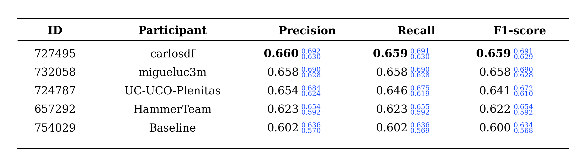
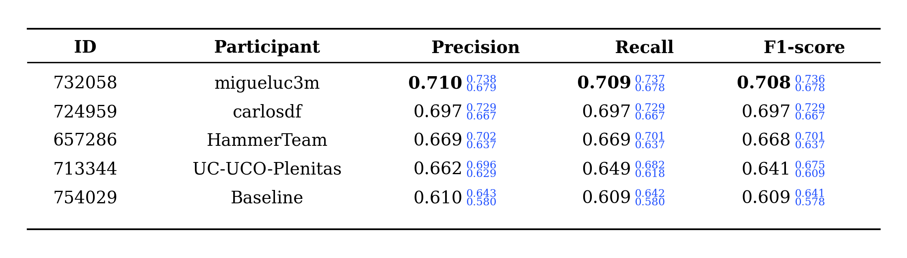

# SpeechMatics

Official evaluation scripts, baseline system and result tables for the **SpeechMatics** shared task.

This repository contains public material related to the competition, including:

- the official Codabench scoring script,
- a basic baseline notebook,
- official result tables.

The competition data and gold labels are **not included** in this repository.

## Repository structure

```text
SpeechMatics/
├── scoring/       # Official Codabench scoring script
├── baselines/     # Baseline system and submission example
├── results/       # Official result tables
├── docs/          # Additional documentation
└── README.md
```
## Tasks

SpeechMatics includes two irony detection tasks:

- **Task 1:** text-only irony detection.
- **Task 2:** multimodal irony detection using text and audio information.

Both tasks are submitted through a single CSV file with the following columns:

```csv
id,label_t1,label_t2
```

Allowed labels are:

```text
ironia
no_ironia
```

If a participant does not submit predictions for one task, the corresponding column can be left empty.

## Official scoring

The official scorer computes macro-averaged Precision, Recall and F1-score for each task. The global `macro_f1` score is computed as the average of the available task F1-scores.

The scoring script also reports bootstrap 95% confidence intervals for each metric using item-level resampling.

## Baseline

The baseline script provides a simple submission example:

- Task 1: TF-IDF text features + LinearSVC.
- Task 2: TF-IDF text features + MFCC audio features + SVC.

Example usage:

```bash
python baselines/basic_baseline_speechmatics.py \
  --train-csv train/corpus_ironia_iberlef2026_train.csv \
  --test-csv test/corpus_ironia_iberlef2026_test.csv \
  --train-audio-dir train/audios/audios_flac \
  --test-audio-dir test/audios/audios_flac \
  --output submission_file.csv
```

The script generates a submission file with the required format:

```csv
id,label_t1,label_t2
```

## Official results

The official ranking is based on the mean F1-score. Bootstrap 95% confidence intervals are also provided to help interpret the robustness of the results.

### Task 1



### Task 2



## Installation

```bash
git clone https://github.com/ancase3/SpeechMatics.git
cd SpeechMatics
pip install -r requirements.txt
```

## Data availability

The competition data are not distributed through this repository. Participants should access the data through the official competition platform.

## Citation

If you use this repository or participate in the shared task, please cite the SpeechMatics overview paper once available.


## License

The code in this repository is released under the MIT License.

